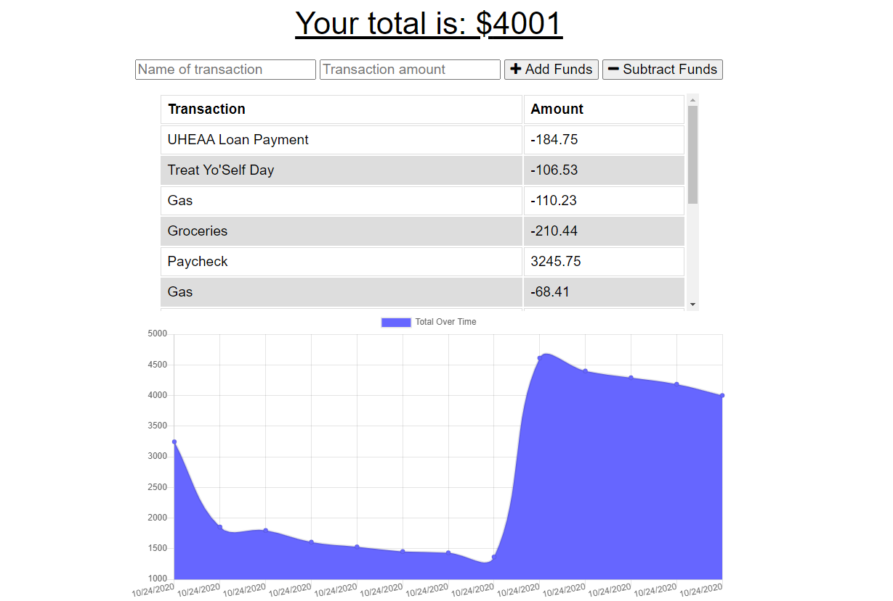
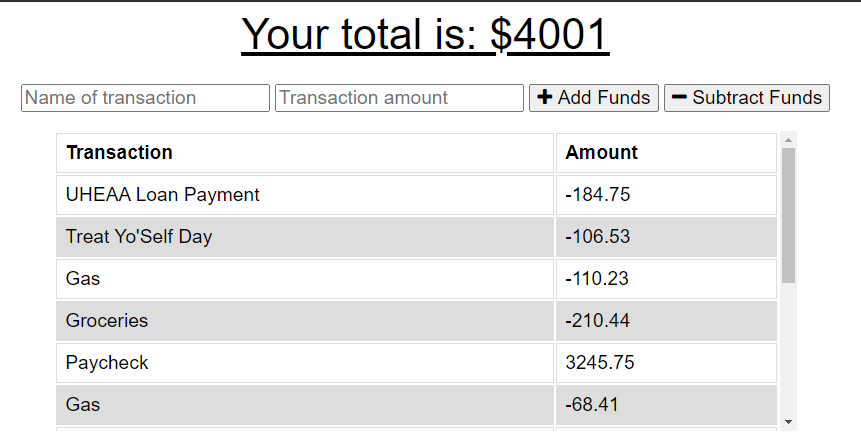
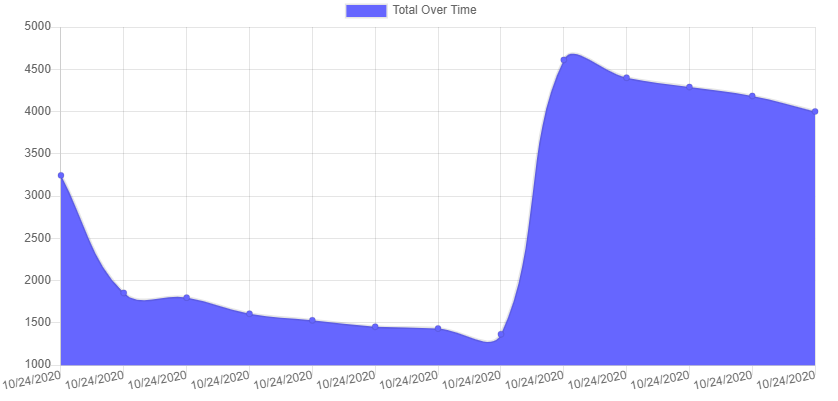
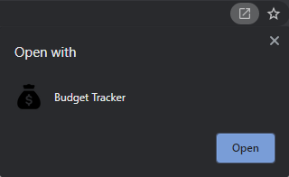
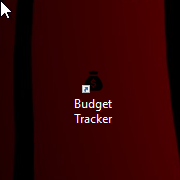
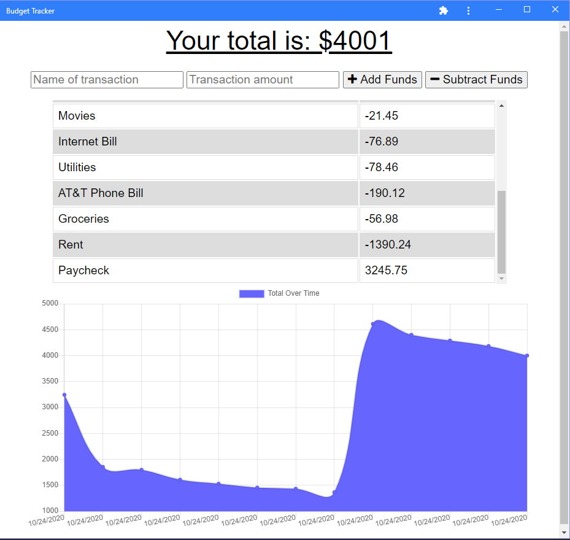

# PWA-Budget-Tracker

## Description
A budget tracker application to assist users in adding expenses and deposits to their budget with or without a connection to the internet. Users have functionality of the application even while offline. The budget application updates their total once a connection to the internet is re-established. Application utilizes Express.js, Service Workers, and IndexDB API.

## Table of Contents
  - [Description](#description)
  - [Installation](#installation)
  - [Usage](#usage)
  - [License](#license)
  - [Contributing](#contributing)
  - [Resources](#resources)
  - [Questions](#questions)

## Installation
Download a copy of this repo to a directory of your choice. To install, you will need to run `npm i` or `npm install` to get all the dependencies running. Following proper installation of the dependencies, you will type `npm start` on the root directory terminal to start the server.

## Usage
Upon successful deployment of the server, the application will run locally on the following address: http://localhost:3001/

Within the application, either run on the website or from the extension download available, a user can add transations for revenue and expenditures to their account. This application is set to work regardless if the user is offline because once the user connects online again, the database is updated to reflect entries done during offline-mode.

The following screenshot is the fully deployed website available here: https://intense-sea-12375.herokuapp.com/

The top of the budget tracker is where users can enter their transaction information. A user may tab over or mouse click to select options.

Despite multiple transactions entered, the pane will remain a fixed size to continue showing the graph below in real time.

For offline-mode access, users have the ability to download the extension through the (+) button at the top right of their address bar. It becomes a deployable application through the Budget Tracker app stored on a user's desktop after installation. As shown below:

When users choose to utilize the extension, the view is as such:

## License
This project is covered by the MIT license. 

## Contributing
At this time, Devmadia is not interested in contributors to this application.

## Resources
1. [Node.js](https://nodejs.org/en/)
2. [Express](https://www.npmjs.com/package/express)
3. [Mongoose](https://www.npmjs.com/package/mongoose)
4. [Heroku](https://www.heroku.com)
5. [MongoDB Atlas](http://wwww.mongodb.com/)

## Questions
Visit my GitHub: 

If you have any additional questions not answered here or wish to contact me regarding developments, please email me at 
[thedevmadia@gmail.com](mailto:thedevmadia@gmail.com)